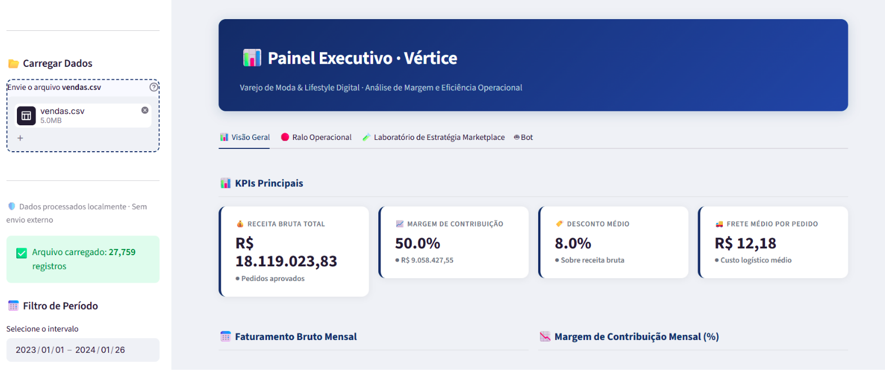
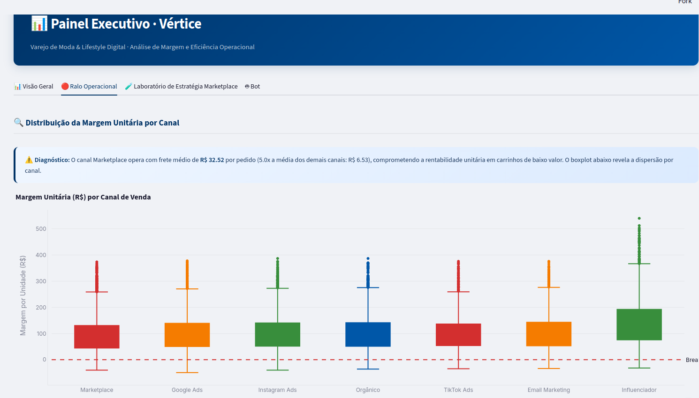
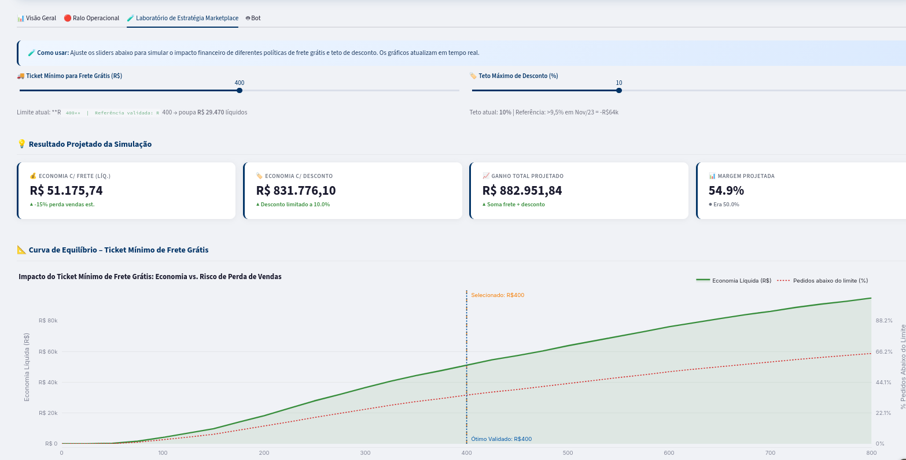
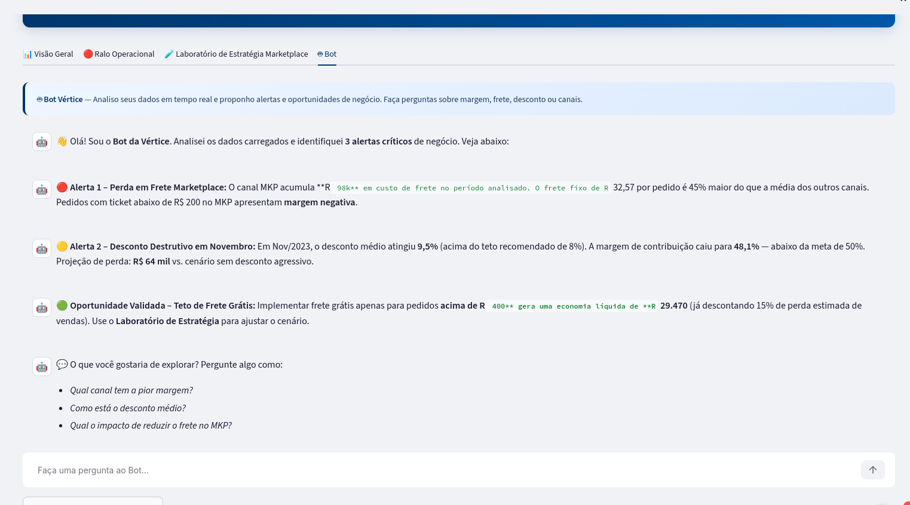

# Vértice · Painel Executivo & Guardião de Margem

Dashboard interativo desenvolvido em **Streamlit** para diagnóstico de rentabilidade, simulação de elasticidade e eficiência operacional no varejo de moda e lifestyle digital da Empresa Vértice Retail desenvolvida para case no [Bootcamp IA Builder da Elogroup](https://elogroup.com/bootcamp/).

> **Projeto desenvolvido no Bootcamp de IA da EloGroup (IA Builders)**  
> Desafio prático voltado para a aplicação de Inteligência Artificial Generativa e Analytics Avançado na resolução de problemas estratégicos reais de negócios.

 **Acesse o painel em produção:** [Link Deploy Streamlit](https://vertice-dashboard.streamlit.app/)  (se aparecer a mensagem "Yes, get this app back up!", basta clicar no botão)

 **Notebook de Análise Exploratória:** [Google Colab](https://colab.research.google.com/drive/1cAA8d34fhxaucLPct49ZO7tVvJNGo5ja?usp=sharing)

---



---

## Contexto de Negócio: "Paradoxo do Crescimento"

A **Vértice Retail** alcançou um crescimento de cerca de **40% em faturamento bruto**, atingindo recorde histórico de **R$ 3,0 milhões em vendas no mês de Novembro/2023**. No entanto, a margem de contribuição operacional despencou para sua mínima histórica de **48,1%** (rompendo o piso saudável de 50,0%) (informações entregues  para gente).

O diagnóstico revelou que o crescimento de volume foi obtido às custas da margem da empresa, impulsionado por dois ralos operacionais críticos:
1. **Frete Fixo no Marketplace:** O frete médio de **R$ 32,57** por pedido consumia até **32,8%** do custo em carrinhos de até R$ 100,00.
2. **Excesso de Desconto:** Em picos sazonais (Black Friday), o desconto médio de **9,55%** ultrapassou o ponto de equilíbrio elástico, sacrificando mais de **R$ 64 mil de lucro limpo** e atraindo compradores eventuais com retenção de apenas **7,1%** no Mês 1.

---

## Como a IA foi Utilizada no Projeto

O projeto adotou uma abordagem híbrida de **Analytics Determinístico + IA Generativa**, garantindo alta velocidade de prototipação sem riscos de alucinação de dados financeiros:

* **Engenharia de Software & Prototipação Rápida:** Modelo Claude 3.5 Sonnet foi empregado para orquestrar o código do Streamlit e arquitetar a lógica de interface (UI/UX) do Dashboard, aplicando o conehcimento de Prompt Engineering das aulas. Alterações manuais foram feitas no código para corrigir resultados. 
---

## Análise Exploratória & Rastreabilidade (Google Colab)

Toda a fase de diagnóstico estatístico, perfilamento dos 5 datasets do DataRoom (`vendas.csv`, `marketing.csv`, `clientes.csv`, `estoque.csv` e `atendimento.csv`) e validação matemática da curva de elasticidade foi documentada no Google Colab:

**Link do Notebook:** [Abrir Análise Exploratória no Google Colab](https://colab.research.google.com/drive/1cAA8d34fhxaucLPct49ZO7tVvJNGo5ja?usp=sharing)

**Destaques auditados no Colab:**
* Sanity checks e distribuições das bases de dados.
* Curva de elasticidade de desconto comprovando saturação em 10,0%.
* Modelagem de sensibilidade do piso de frete no Marketplace: corte ótimo em **R$ 400,00**, gerando **+R$ 29.470,47 líquidos** mesmo com 15% de abandono de carrinho.

---

## Funcionalidades do Dashboard

O painel é estruturado em quatro abas complementares:

### 1. Visão Geral
Visão executiva com cards de KPIs dinâmicos (Receita, Margem, Desconto e Frete Médio), gráfico de evolução mensal comparando faturamento versus margem de contribuição (com destaque dinâmico para o pior mês) e participação por canal.


---

### 2. Ralo Operacional
Diagnóstico aprofundado com **Boxplot** de dispersão da margem unitária por canal (evidenciando a cauda negativa do Marketplace), gráfico de **Barras 100% Empilhadas** do peso do frete fixo por faixa de ticket e **Mapa de Calor de Safra (Cohort)** de retenção de clientes.



---

### 3. Laboratório de Estratégia Marketplace
Simulador interativo onde o executivo ajusta sliders de **Ticket Mínimo para Frete Grátis** e **Teto de Desconto (%)**. O simulador calcula em tempo real a economia líquida e a nova margem projetada da companhia com base na modelagem de elasticidade.



---




---

## Como Rodar Localmente

### Pré-requisitos
* Python 3.10 ou superior
* Git

```bash
# 1. Clone o repositório
git clone https://github.com/GabyyRD/vertice-dashboard
cd vertice-dashboard

# 2. Crie e ative um ambiente virtual
python3 -m venv .venv
source .venv/bin/activate       # Windows: .venv\Scripts\activate

# 3. Instale as dependências
pip install -r requirements.txt

# 5. Execute a aplicação
streamlit run app.py